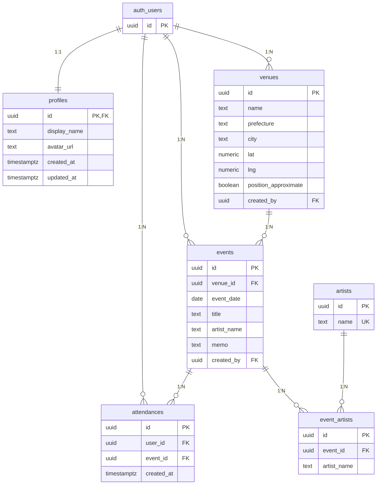

# ライブ記録アプリ データベース設計書

DB の目的・方針・ER 図・テーブル定義をまとめた設計書です。  
実装詳細は `DB_SCHEMA.md`、SQL は `supabase_init.sql` および各 `migration_*.sql` を参照してください。

---

## 1. 設計の目的

- **「誰が・どの公演に・行った」** を 1 行で表現する（参加記録 = attendance）。
- **公演（event）** を軸にし、1 公演 = 1 会場・1 日・1 タイトル。同じ公演に複数ユーザーが「行った」と記録できる。
- **会場（venue）** は事前投入またはユーザー登録。公演は会場に紐づく。
- ランキング（公演数・会場数・都道府県数・アーティスト別）は、参加記録と公演・会場から集計する。

---

## 2. 設計方針

| 方針 | 内容 |
|------|------|
| 公演中心 | 1 件の「行った」= 1 つの **event** に 1 人の **user** が紐づく（**attendance**）。 |
| 会場の重複防止 | 同じ「会場名＋都道府県」は 1 つにまとめる（UNIQUE またはアプリ側で検索してから登録）。 |
| 認証 | Supabase Auth（`auth.users`）を利用。アプリ用の表示名などは `profiles` で保持。 |
| フェス・対バン | 1 公演に複数アーティストを紐づけ可能（`event_artists` テーブル）。 |
| マップ | 会場の `lat` / `lng` でピン表示。`position_approximate` で概略位置を区別。 |

---

## 3. ER 図（Mermaid）

GitHub や VS Code（Mermaid 対応）でそのまま表示できます。  
**カーディナリティ**はリレーションの**両端**に付きます（左が第1エンティティ側、右が第2エンティティ側）。`||`＝1、`o{`＝N を表します。  
draw.io 用の図（同様に箱の端に 1 または N を表示）は `diagrams/er_live_record.drawio` を参照してください。

---

## 4. エンティティ一覧

| 論理名 | テーブル | 説明 |
|--------|----------|------|
| 認証ユーザー | auth.users | Supabase 管理。アプリでは参照のみ。 |
| ユーザープロフィール | profiles | 表示名・アバター。auth.users と 1:1。 |
| 会場 | venues | 会場名・住所・緯度経度。事前投入またはユーザー登録。 |
| 公演 | events | 会場・日付・タイトル・アーティスト名・メモ。 |
| 参加記録 | attendances | ユーザーが公演に「行った」を 1 行で表現。 |
| 公演アーティスト | event_artists | フェス・対バン用。1 公演に複数アーティスト。 |
| アーティストマスタ | artists | 入力候補・検索用。任意。 |

---

## 5. リレーション概要

- **auth.users ─ profiles** … 1:1。サインアップ時に profiles を自動作成（トリガー）。
- **auth.users ─ venues.created_by** … 会場を登録したユーザー（NULL 可）。
- **auth.users ─ events.created_by** … 最初に「行った」と登録したユーザー。
- **auth.users ─ attendances.user_id** … 誰が行ったか。
- **venues ─ events.venue_id** … 公演がどの会場で行われたか。
- **events ─ attendances.event_id** … どの公演に参加したか。
- **events ─ event_artists** … その公演に出演したアーティスト（複数可）。

---

## 6. 主要インデックス・制約

| テーブル | 制約・インデックス |
|----------|---------------------|
| venues | UNIQUE (name, prefecture) |
| events | UNIQUE (venue_id, event_date, title) |
| attendances | UNIQUE (user_id, event_id) |
| artists | UNIQUE (name) |

---

## 7. RLS（Row Level Security）方針

| テーブル | 方針 |
|----------|------|
| profiles | 全員 read。自分の行のみ update / insert。 |
| venues | 全員 read。認証済みは insert。更新は別ポリシー（migration_venues_update_policy.sql）。 |
| events | 全員 read。認証済みは insert。更新は別ポリシー（migration_events_update_policy.sql）。 |
| attendances | 全員 read（ランキング用）。自分の行のみ insert / delete。 |

---

## 8. 参照ドキュメント

| ファイル | 内容 |
|----------|------|
| `docs/DB_SCHEMA.md` | カラム単位のスキーマ詳細 |
| `docs/supabase_init.sql` | 初期テーブル・RLS 作成 |
| `docs/migration_*.sql` | カラム追加・ポリシー追加 |
| `docs/diagrams/er_live_record.drawio` | draw.io 用 ER 図（diagrams.net で編集可） |

---

*最終更新: 2025-03-07*
